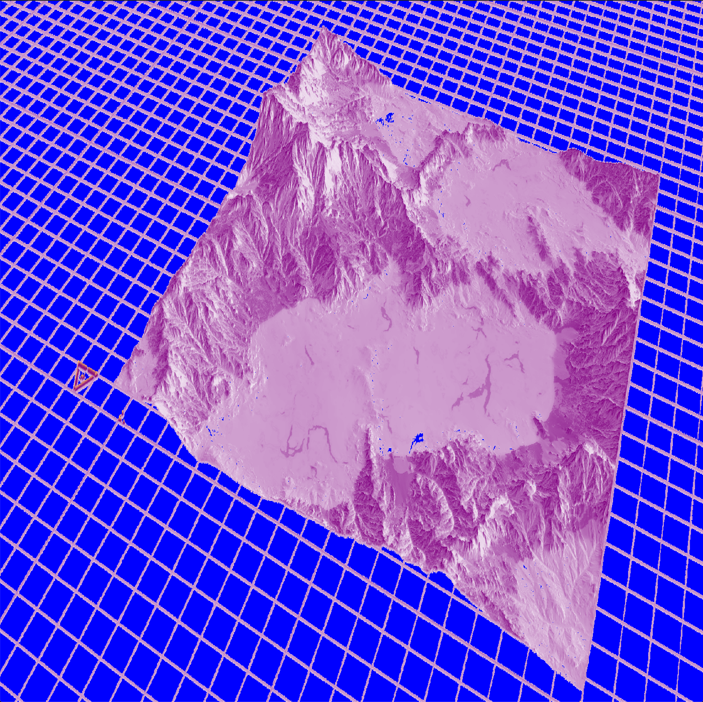
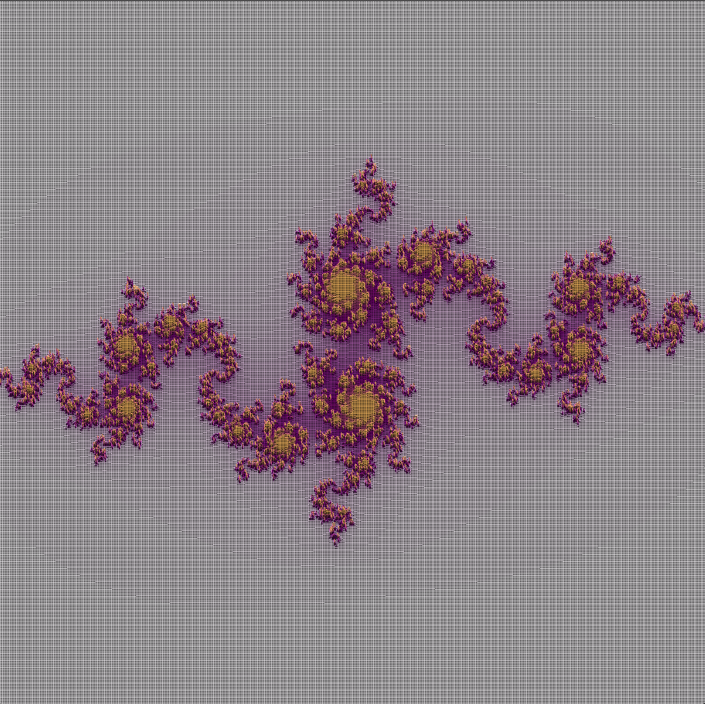
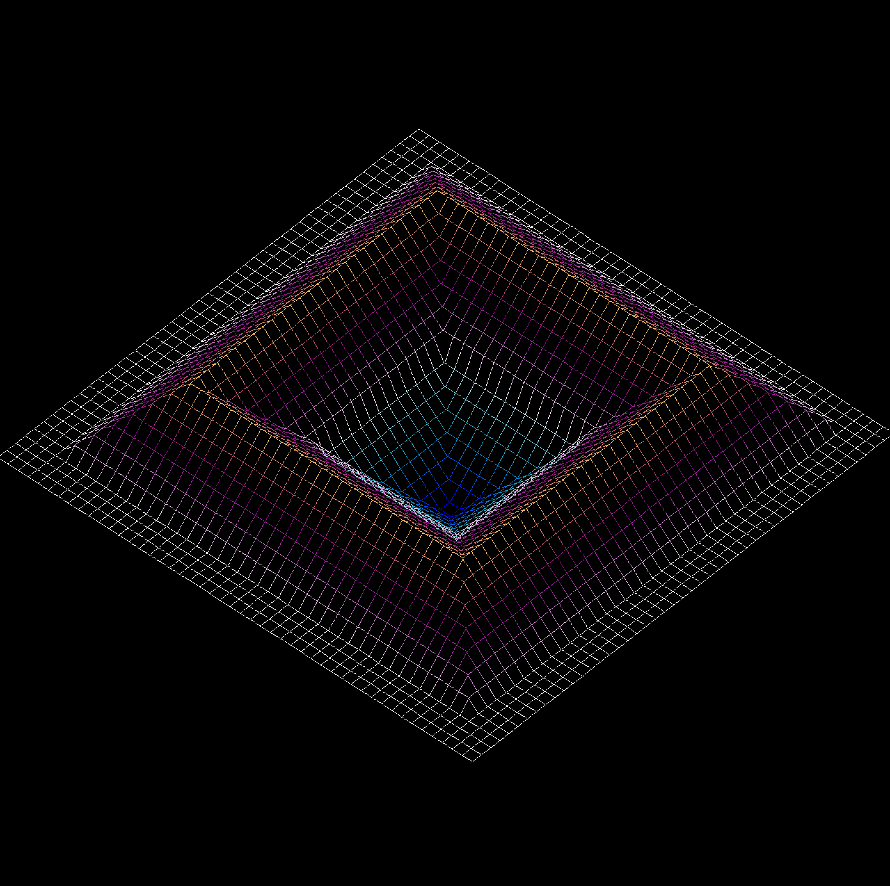
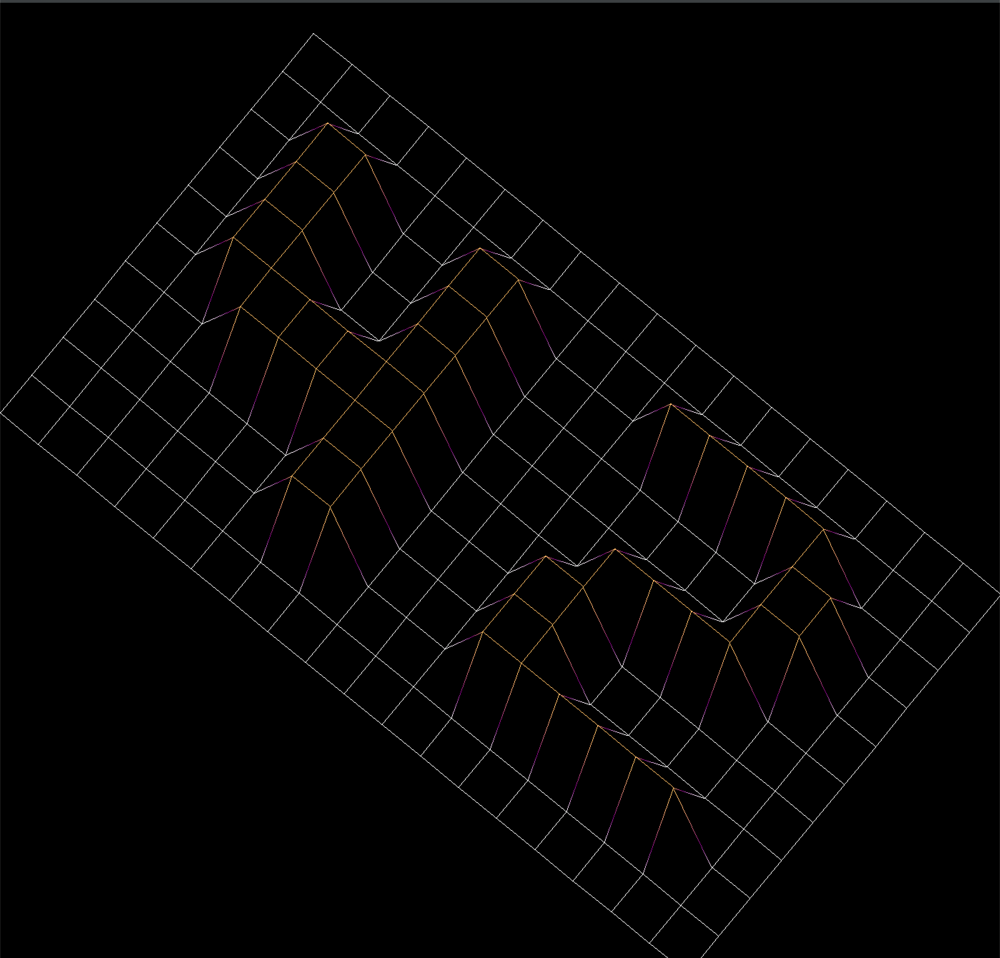

# 3D Wireframe Renderer

This project is a simple 3D wireframe renderer implemented in C. It uses the MiniLibX library to create a graphical window and draw lines.

## Features

- Reads data points from a file
- Transforms 3D coordinates into a 2D projection
- Allows user to interactively rotate, move, and zoom the wireframe model
- Supports different background colors and opacity levels

# Dependency

This project needs the compiled MLX_42 lib in the source directory of the project.
To clone  the lib type
	(make clone_MLX)

# MLX Dependencies
For 42 Mac computers "make install_brew" should fill the dependencies. On normal Mac the homebrew should be fine.
Type
	(make libmlx)
to compile MLX_42 into this project

To compile the project, run:
	(make)

For Linux (Ubuntu, Mint, Pop OS...):
	(sudo apt update
	sudo apt install build-essential libx11-dev libglfw3-dev libglfw3 xorg-dev)

For Linux (Manjaro, Endeavor, Garuda):
	(sudo pacman -S glfw-x11)

Type
	(make libmlx)
to compile MLX_42 into this project

To compile the project, run:
(make linux)

Windows is currently not supported

# Usage

To run the program, use (./fdf). The argument formatting will be displayed due to missing arguments.
Example input files are in the directory "input".
example command to run the program:
(./fdf input/42.fdf)

When fdf runs succesfully it will display the usable keys.

# License
MIT License

Copyright (c) [2023] [Fabian Rapp]

Permission is hereby granted, free of charge, to any person obtaining a copy
of this software and associated documentation files (the "Software"), to deal
in the Software without restriction, including without limitation the rights
to use, copy, modify, merge, publish, distribute, sublicense, and/or sell
copies of the Software, and to permit persons to whom the Software is
furnished to do so, subject to the following conditions:

The above copyright notice and this permission notice shall be included in all
copies or substantial portions of the Software.

THE SOFTWARE IS PROVIDED "AS IS", WITHOUT WARRANTY OF ANY KIND, EXPRESS OR
IMPLIED, INCLUDING BUT NOT LIMITED TO THE WARRANTIES OF MERCHANTABILITY,
FITNESS FOR A PARTICULAR PURPOSE AND NONINFRINGEMENT. IN NO EVENT SHALL THE
AUTHORS OR COPYRIGHT HOLDERS BE LIABLE FOR ANY CLAIM, DAMAGES OR OTHER
LIABILITY, WHETHER IN AN ACTION OF CONTRACT, TORT OR OTHERWISE, ARISING FROM,
OUT OF OR IN CONNECTION WITH THE SOFTWARE OR THE USE OR OTHER DEALINGS IN THE
SOFTWARE.
